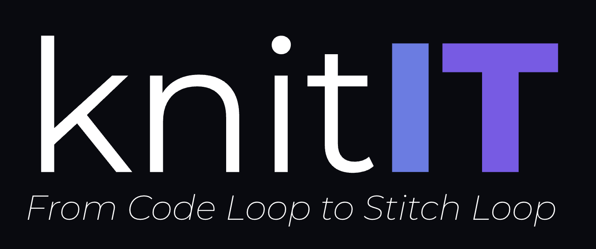

# knitIT

🇷🇺 [Русский](#русский) · 🇬🇧 [English](#english)

---

## Русский

Программа с открытым исходным кодом для построения выкроек трикотажных изделий, созданных на вязальных машинах.

knitIT — форк проекта [Seamly2D](https://github.com/FashionFreedom/Seamly2D), переработанный под задачи вязания на машине. Базовая часть — геометрическое ядро, движок формул, система мерок и построения — унаследована от Seamly2D и адаптируется под новую предметную область.

Распространяется под лицензией GPLv3+, как и исходный проект — см. раздел "Лицензия" ниже. 
Будет доступна для Windows, macOS и Linux.

### Что делает программа

Позволяет:
- вести файл мерок и вводных данных модели (в knitME);
- строить выкройку трикотажного изделия по формулам, привязанным к меркам;
- получать готовую схему/выкройку для вязания на машине.

### Статус проекта

knitIT находится в стадии адаптации. Основная часть работы уже сделана в knitME (редакторе мерок, наследнике SeamlyMe): добавлен собственный словарь вязальных мерок, переработан интерфейс редактирования мерок и формул, добавлена подсветка строк с проблемными или зависимыми значениями, конвертер файлов мерок старого формата и другие улучшения. В самом knitIT (построение и раскладка выкройки) тоже появились первые изменения — например, миллиметровая сетка на холсте и доработки в движке формул, — но основная логика построения выкройки пока остаётся такой же, как в исходном швейном проекте, и её адаптация под вязание ещё впереди. Подробности — во внутренней документации проекта (`CLAUDE.md` и техзадания в папке разработки).

### Поддерживаемые платформы

- Windows 10 и 11 (64-бит)
- macOS Ventura (13), Sonoma (14), Sequoia (15), Tahoe (26)
- Большинство актуальных дистрибутивов Linux (Flatpak, AppImage)

### Скачать

_Раздел будет заполнен после того, как для knitIT появится собственная сборка и отдельный репозиторий/релизы — сейчас ссылки на готовые файлы для скачивания вести некуда, публиковать старые ссылки на Seamly2D было бы неверно, так как там нет функциональности для вязания._

### Сообщество

_Раздел будет заполнен, когда появится собственное место для общения пользователей knitIT (форум, чат, вики). Ссылки на форум/вики исходного проекта Seamly2D сюда сознательно не перенесены — это сообщество швейного приложения, не вязального._

### Для разработчиков

- Внутренняя документация по разработке — см. `CLAUDE.md` в корне репозитория.

### Лицензия

knitIT распространяется под лицензией GPLv3+, как и исходный проект Seamly2D, от которого он унаследован. 
Подробнее: <https://www.gnu.org/licenses/gpl-3.0.html>

Прочие компоненты и их лицензии (сверено с заголовками файлов и файлами лицензий в текущем репозитории `dyshechka/knitIT`, ветка `develop`):

- QMuParser — [MIT license](https://opensource.org/licenses/MIT) — в README исходного проекта Seamly2D эта лицензия ошибочно указана как "Simplified BSD license"; в самих исходниках (заголовки `qmuparserbase.cpp`, `qmuparser.cpp` и других файлов папки) — текст именно MIT.
- VPropertyExplorer — [LGPLv2.1 license](https://www.gnu.org/licenses/old-licenses/lgpl-2.1.en.html) — подтверждено заголовком `vproperty.cpp`.
- xerces-c — [Apache License, Version 2.0](https://apache.org/licenses/LICENSE-2.0) — подтверждено файлом `src/libs/xerces-c/LICENSE`.

Основано на проекте [Seamly2D](https://github.com/FashionFreedom/Seamly2D) — программе для построения швейных выкроек, также распространяемой под GPLv3+.

[⬆ к переключателю языков](#knitit)

---

## English

Open-source software for building patterns for knitwear made on a knitting machine.

knitIT is a fork of [Seamly2D](https://github.com/FashionFreedom/Seamly2D), adapted for machine knitting. The underlying core — the geometry engine, the formula engine, the measurement and construction system — is inherited from Seamly2D and is being adapted to the new domain.

Released under the GPLv3+ license, same as the original project — see "License" below. 
Will be available for Windows, macOS, and Linux.

### What it does

Lets you:
- maintain a file of a model's measurements and input parameters (in knitME);
- build a knitwear pattern from formulas tied to measurements and/or gauge;
- get a finished pattern/schematic ready for knitting on a machine.

### Project status

knitIT is mid-adaptation. Most of the work so far has gone into knitME (the measurement editor, knitIT's counterpart to SeamlyMe): a dedicated knitting-measurement dictionary, a reworked measurement/formula editing interface, row highlighting for problem or dependent values, an old-format file converter, and other improvements. knitIT itself (pattern construction and layout) has also started to see changes — for example, a millimeter grid on the canvas and formula-engine fixes — but the core pattern-construction logic is still the same as in the original sewing project, and adapting it for knitting is still ahead. Details live in the project's internal documentation (`CLAUDE.md` and the task specs in the development folder).

### Supported platforms

- Windows 10 & 11 (64-bit)
- macOS Ventura (13), Sonoma (14), Sequoia (15), Tahoe (26)
- Most current Linux distros (Flatpak, AppImage)

### Download

_This section will be filled in once knitIT has its own build and a separate repository/releases — there's currently nowhere to point download links, and publishing the old Seamly2D links would be misleading, since those don't include any knitting functionality._

### Community

_This section will be filled in once knitIT has its own place for users to gather (forum, chat, wiki). Links to the original Seamly2D project's forum and wiki were deliberately not carried over here — that's the sewing application's community, not the knitting one._

### For developers

- Internal development documentation — see `CLAUDE.md` at the repository root.

### License

knitIT is released under the GPLv3+ license, same as the original Seamly2D project it's inherited from. 
More info: <https://www.gnu.org/licenses/gpl-3.0.html>

Other components and their licenses (verified against the file headers and license files in the current `dyshechka/knitIT` repository, `develop` branch):

- QMuParser — [MIT license](https://opensource.org/licenses/MIT) — the original Seamly2D README mislabels this as "Simplified BSD license"; the actual source headers (`qmuparserbase.cpp`, `qmuparser.cpp`, and others in that folder) carry MIT license text.
- VPropertyExplorer — [LGPLv2.1 license](https://www.gnu.org/licenses/old-licenses/lgpl-2.1.en.html) — confirmed by the `vproperty.cpp` header.
- xerces-c — [Apache License, Version 2.0](https://apache.org/licenses/LICENSE-2.0) — confirmed by the `src/libs/xerces-c/LICENSE` file.

Based on [Seamly2D](https://github.com/FashionFreedom/Seamly2D) — a sewing-pattern-making application, also released under the GPLv3+ license.

[⬆ back to language switcher](#knitit)
